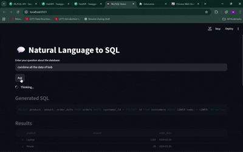

# 💬 Natural Language to SQL (NL2SQL)

> 🧠 An end-to-end **RAG-powered application** that converts **natural language** into **SQL** and explains the results.  
> Built with **FastAPI**, **Streamlit**, **SQLite**, **FAISS**, and **Google Gemini**.  

---

## ✨ Features

### 🔹 Core Functionality
- Translate natural language → SQL queries using **Gemini LLM**  
- Execute queries directly on SQLite (`demo1.db`)  
- Generate **human-friendly explanations** of results  
- Interactive **Streamlit UI**  

### 🔹 Retrieval & Schema Awareness
- Schema retriever for **relevant table/column context**  
- `/schema` endpoint to expose DB structure  
- Schema-aware prompting for higher SQL accuracy  

### 🔹 Context & Conversation
- **Conversation history manager** (loop context)  
- Follow-up queries (e.g. “Now show only Bob”)  
- Configurable context window size  

### 🔹 Caching & Optimization
- **Semantic cache with FAISS**  
- Embedding-based query similarity search  
- Instant responses for repeated/related queries  
- Cache hit/miss logging  

### 🔹 SQL Safety & Validation
- Only `SELECT` queries allowed  
- Destructive SQL (`DROP`, `DELETE`, etc.) blocked  
- Automatic **LIMIT 100** on queries  
- SQL repair for invalid queries  

### 🔹 Logging & Observability
- Query log (`query_log.txt`) with question, SQL, results, explanation  
- Cache hit/miss statistics  
- Planned: query latency metrics  

### 🔹 Result Handling
- Results in **JSON** + **ASCII tables**  
- Auto-detect numeric columns → render **charts** in Streamlit  
- Handles empty results gracefully  

### 🔹 Data & DB Management
- Works with SQLite out-of-the-box  
- `seed_db.py` for populating sample DB  
- Planned: PostgreSQL + pgvector support  
- Planned: CSV upload via Streamlit  

### 🔹 FastAPI Backend
- `/ask` → NL query → SQL + result + explanation  
- `/schema` → return DB schema  
- `/docs` → Swagger UI  
- Optional: API key authentication  

### 🔹 Streamlit UI
- Query input box  
- Display SQL with syntax highlighting  
- Interactive DataFrame for results  
- Auto chart rendering for numeric results  
- Planned: schema explorer + query history sidebar  

### 🔹 Testing & Evaluation
- `run_batch.py` for batch evaluation of queries  
- `expected.py` for regression testing  
- Accuracy benchmarking support  

### 🔹 Developer Experience
- Clean modular design (cache, retriever, validator, etc.)  
- `.env` support for keys  
- `.gitignore` for sensitive files  
- `requirements.txt` for reproducible environments  

---

## 📂 Project Structure

| File / Folder       | Description |
|---------------------|-------------|
| `test1.py / api.py` | FastAPI backend (entrypoint) |
| `streamlit_app.py`  | Streamlit UI |
| `cache_manager.py`  | Semantic cache (FAISS) |
| `context_manager.py`| Conversation context |
| `db.py`             | DB utils + schema extractor |
| `query_engine.py`   | Gemini NL→SQL generator |
| `retriever.py`      | Schema retriever |
| `validator.py`      | SQL validation & repair |
| `explainer.py`      | Plain-English explanation |
| `logger.py`         | Query logging |
| `demo1.db`          | Sample DB |
| `seed_db.py`        | Seed script |
| `run_batch.py`      | Batch evaluation |
| `requirements.txt`  | Dependencies |
| `README.md`         | Project documentation 🚀 |

---
## 🎥 Demo

